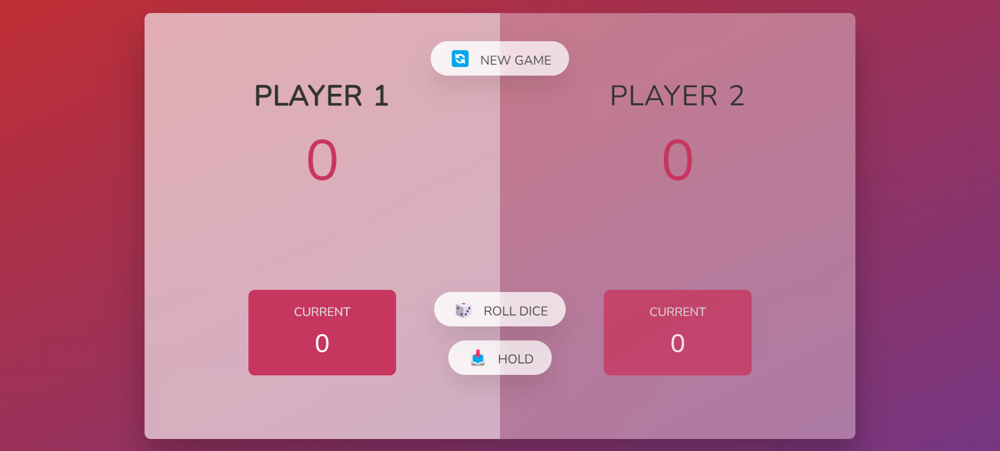

# Dice Game

Welcome to the Dice Game! This simple web-based game allows two players to take turns rolling dice and accumulating scores. The objective is to reach a score of 100 before your opponent does.

## How to Play

1. Open the game in your web browser.
2. Click the "Roll Dice" button to roll the dice.
3. The number on the dice will be added to the current player's score.
4. If a player rolls a 1, their score will reset to 0.
5. Keep rolling the dice and accumulating scores until one player reaches 100 points.
6. The player who reaches 100 points first wins the game!

## Features

- Simple and intuitive user interface.
- Two-player gameplay.
- Realistic dice rolling animation.
- Automatic score tracking.
- Immediate feedback on each roll.
- Responsive design for optimal viewing on all devices.

## Technologies Used

- HTML
- CSS
- JavaScript

## Deployment

The game is deployed and accessible online. You can play it [here](https://dice-game-nv.netlify.app/).

## Screenshots

## Contributing

If you have any suggestions, bug reports, or feature requests, feel free to open an issue or submit a pull request. Your contributions are greatly appreciated!
